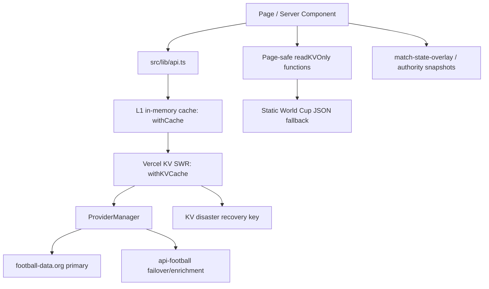

# GoalRadar Project Context Pack

Last updated: 2026-06-29

This document is the shared project brain for GoalRadar. It summarizes the current product, architecture, data flow, SEO/revenue state, known risks, and roadmap so future Codex, Claude Code, and ChatGPT sessions can start with the same context.

## 1. Project Overview

GoalRadar is a Next.js football scores and World Cup 2026 content platform.

The product combines:

- Live football scores, fixtures, standings, results, team pages, and match detail pages.
- A large FIFA World Cup 2026 SEO surface: hub, schedule, fixtures, results, standings, groups, bracket, teams, venues, predictions, streaming guides, TV schedules, country watch-live guides, and knockout round pages.
- Reliability tooling around external sports data providers, Vercel KV caching, static World Cup fallback data, authority snapshots, state overlays, and debug/admin dashboards.
- Monetization surfaces for AdSense, affiliate blocks, newsletter capture, and push notification opt-ins.

The site is built as a public consumer product, not an internal dashboard. Admin pages exist but are explicitly unauthenticated MVP tools and are marked `noindex`.

## 2. Business Goal

Primary goal:

- Capture organic search traffic around FIFA World Cup 2026 and live football intent.

Secondary goals:

- Monetize traffic through AdSense, affiliate offers, newsletter growth, and push notification re-engagement.
- Build topical authority around World Cup 2026 with highly crawlable, internally linked, structured, evergreen and live-updating pages.
- Keep match, fixture, result, standings, and bracket data available despite provider rate limits or outages.

Near-term business focus:

- World Cup 2026 growth.
- Search Console readiness.
- AdSense compliance and ad inventory readiness.
- High-reliability match data before and during tournament traffic spikes.

## 3. Current Architecture

Stack:

- Framework: Next.js App Router.
- Runtime: React 19.
- Language: TypeScript.
- Styling: Tailwind CSS.
- Data cache: in-memory L1 cache plus Vercel KV L2 cache.
- Database: Vercel Postgres for newsletter subscribers when configured.
- Email: Resend.
- Analytics: GA4 client script plus server-side GA4 Data API reporting.
- Push notifications: OneSignal Web Push.
- Ads: Google AdSense via reusable ad slot components.

Main request/data flow:



Key architectural principles:

- Pages should avoid direct provider calls where page-safe cached variants exist.
- Provider calls should be centralized in `src/lib/api.ts` and `src/lib/providers/*`.
- `ProviderManager` owns primary/failover provider behavior.
- Vercel KV is the cross-instance cache and disaster-recovery layer.
- Static World Cup data in `src/data/worldcup/` is the fallback for pre-tournament structural data.
- Dynamic XML sitemaps use cached/page-safe data and must not increase provider API pressure.
- Admin/debug endpoints are operational tools, not public product features.

## 4. Folder Structure

Important top-level structure:

```text
src/
  app/
    page.tsx
    layout.tsx
    robots.ts
    sitemap.ts
    admin/
      performance/
      seo/
    api/
      analytics/
      cache-stats/
      cron/
      debug/
      newsletter/
      push/
      refresh/
      revalidate/
    world-cup-2026/
    match/[id]/
    teams/[slug]/
    team/[id]/
    competition/[code]/
    live/
    schedule/
    standings/
  components/
    ads/
    AdSlot.tsx
    MatchCard.tsx
    Navbar.tsx
    WC*.tsx
    AnalyticsTracker.tsx
    NavigationTracker.tsx
    OneSignalProvider.tsx
  contexts/
    TimezoneContext.tsx
  data/
    worldcup/
      fixtures.json
      groups.json
      loader.ts
      stadiums.json
      teams.json
      tv-guide.json
  lib/
    api.ts
    cache.ts
    kv-cache.ts
    providers/
    analytics.ts
    ga4-reporting.ts
    wc-*.ts
    match-*.ts
    authority-*.ts
    scheduler-health.ts
    revalidation.ts
scripts/
docs/
public/
  ads.txt
  OneSignalSDKWorker.js
```

Documentation/report files are extensive at repository root. Treat root-level `DATA*`, `WC_*`, `PERF*`, `SEO*`, `OPS*`, and similar Markdown files as audit history and evidence, not primary runtime documentation.

## 5. Important Files

Core app:

- `src/app/layout.tsx`: global metadata, GA4 script, AdSense script, OneSignal script, timezone provider, navigation tracker, navbar, main layout.
- `src/app/page.tsx`: homepage with football/WC entry points.
- `src/app/sitemap.ts`: dynamic split sitemap system.
- `src/app/robots.ts`: robots rules, disallows `/admin/`, `/api/`, `/newsletter/`, declares sitemap and host.
- `src/app/not-found.tsx`: basic 404.

Data and caching:

- `src/lib/api.ts`: public data API used by pages; wraps provider calls with cache/KV and exposes page-safe cached variants.
- `src/lib/cache.ts`: L1 in-memory cache with TTL, in-flight dedupe, stale-on-error fallback, API audit instrumentation.
- `src/lib/kv-cache.ts`: Vercel KV SWR cache with fresh/stale windows, disaster-recovery keys, read-only page-safe access, coalesced background revalidation.
- `src/lib/providers/manager.ts`: primary/failover provider orchestration.
- `src/lib/providers/football-data.ts`: primary provider adapter.
- `src/lib/providers/api-football.ts`: secondary provider/failover/enrichment adapter.
- `src/data/worldcup/loader.ts`: static World Cup 2026 dataset loader and conversion helpers.

SEO/growth:

- `src/app/admin/seo/page.tsx`: SEO readiness dashboard, sitemap probing, robots checks, canonical/schema checklist.
- `src/app/world-cup-2026*/page.tsx`: flat SEO pages for high-volume WC keywords.
- `src/app/world-cup-2026/**/page.tsx`: nested WC hub pages, teams, venues, TV, watch-live, predictions, rounds.
- `src/components/WCPageNav.tsx`, `src/components/WCRelatedLinks.tsx`: internal linking patterns.

Revenue:

- `src/components/ads/AdSlot.tsx`: canonical AdSense wrapper with CLS-safe dimensions and lazy loading.
- `src/components/AdSlot.tsx`: legacy shim/re-export.
- `src/components/AffiliateBlock.tsx`: reusable affiliate CTA component.
- `public/ads.txt`: AdSense ads.txt.
- `src/app/privacy-policy/page.tsx`, `src/app/terms/page.tsx`, `src/app/about/page.tsx`, `src/app/contact/page.tsx`, `src/app/affiliate-disclosure/page.tsx`: trust/compliance pages.

Analytics/admin:

- `src/lib/analytics.ts`: client-side GA4 custom event helpers.
- `src/lib/ga4-reporting.ts`: server-side GA4 Data API reporting client.
- `src/app/api/analytics/summary/route.ts`: 7-day GA4 summary API.
- `src/app/admin/performance/page.tsx`: unauthenticated MVP performance dashboard.

Newsletter/push:

- `src/components/NewsletterSignup.tsx`: double opt-in newsletter UI.
- `src/app/api/newsletter/*`: subscribe, confirm, migrate, admin.
- `src/components/OneSignalProvider.tsx`, `src/components/PushNotificationButton.tsx`: push integration.
- `src/app/api/push/*`: push opt-in/stats APIs.

## 6. APIs

Public/user-facing API routes:

- `GET /api/geo`: geo/country helper.
- `GET /api/live-score/[matchId]`: live score endpoint.
- `GET /api/calendar/[matchId]`: calendar/ICS endpoint.
- `POST /api/newsletter/subscribe`: newsletter subscription.
- `GET /api/newsletter/confirm/[token]`: newsletter confirmation.
- `POST /api/push/opt-in`: push opt-in tracking.
- `GET /api/push/stats`: push stats.

Admin/ops API routes:

- `GET /api/cache-stats`: L1/L2 cache stats, guarded by `CRON_SECRET` when configured.
- `GET /api/analytics/summary`: GA4 7-day page/top-page/top-competition summary.
- `POST /api/newsletter/migrate`: newsletter DB migration, protected by `CRON_SECRET`.
- `GET /api/newsletter/admin`: newsletter admin export/status.
- `POST /api/refresh/wc-fixtures`: refresh WC fixture data.
- `POST /api/refresh/standings`: refresh standings.
- `POST /api/revalidate`: general revalidation.
- `POST /api/revalidate/match/[id]`: match revalidation.
- `POST /api/prewarm/match/[id]`: prewarm match snapshot/cache.

Cron API routes:

- `api/cron/orchestrator`
- `api/cron/prewarm-worldcup`
- `api/cron/repair-enrichment`
- `api/cron/drift-scan`
- `api/cron/health-archive`

Important note: current `vercel.json` is `{}`, so cron endpoints exist but no Vercel cron schedule is currently declared in that file.

Debug API routes:

- Extensive `/api/debug/*` surface exists for provider health, cache health, live telemetry, authority freshness/drift/adoption, prediction accuracy, reliability, SLO compliance, state divergence, enrichment, full audit, and many DATA18-era validation endpoints.
- These routes are operational/internal. Do not link from public pages.
- Check individual route files for auth expectations before exposing externally.

External APIs/services:

- football-data.org: primary football data provider.
- api-football.com: secondary failover/enrichment provider.
- Vercel KV: cache, rate limits, fallback data, telemetry counters, newsletter fallback.
- Vercel Postgres: newsletter subscriber persistence.
- Resend: transactional newsletter confirmation emails.
- GA4 + Google Analytics Data API: client analytics and admin reporting.
- OneSignal: web push notifications.
- Google AdSense: ad serving.

## 7. Data Model

Core app data types live in `src/lib/types.ts`.

Important types:

- `Area`: country/region metadata.
- `Competition`: provider competition object with `id`, `name`, `code`, `type`, `emblem`, `area`.
- `Team`: provider team object with `id`, `name`, `shortName`, `tla`, `crest`.
- `Score`: `winner`, duration, full-time and half-time scores.
- `MatchStatus`: `SCHEDULED`, `TIMED`, `IN_PLAY`, `PAUSED`, `FINISHED`, `POSTPONED`, `CANCELLED`, `SUSPENDED`.
- `Match`: base match card/list object.
- `MatchDetail`: `Match` plus goals, bookings, substitutions, venue, referees.
- `StandingEntry` and `StandingTable`: league/group table data.
- `TeamDetail`: full team profile.
- `HeadToHead`: match H2H aggregates and recent matches.
- `COMPETITIONS`: `PL`, `PD`, `BL1`, `SA`, `FL1`, `CL`, `WC`.

Provider contract:

- `src/lib/providers/types.ts` defines `MatchProvider`.
- Providers must normalize into the shared app types from `src/lib/types.ts`.
- Provider names are currently `football-data` and `api-football`.

World Cup static data:

- `src/data/worldcup/teams.json`: 48 teams.
- `src/data/worldcup/groups.json`: group-to-team mapping.
- `src/data/worldcup/stadiums.json`: 16 host venues.
- `src/data/worldcup/fixtures.json`: 104 fixtures.
- `src/data/worldcup/tv-guide.json`: broadcaster data.
- `src/data/worldcup/loader.ts` converts static data to app-friendly `Match[]`, group fixtures, knockout slots, and lookup maps.

Cache data model:

- KV keys generally use `goalradar:${endpoint}`.
- Disaster recovery keys use `goalradar:dr:${endpoint}`.
- KV entries store `data`, `fetchedAt`, and `freshUntil`.
- Static sitemap caches use KV when available.

## 8. Coding Standards

Observed standards:

- TypeScript with strict mode.
- Next.js App Router conventions.
- Server components by default; client components only for interactivity/tracking.
- Centralize data access in `src/lib/api.ts` and provider adapters.
- Prefer typed provider normalization over ad hoc page-level fetches.
- Keep fallback paths explicit: cache -> KV -> DR -> static/empty.
- Use `Metadata` exports for page-level SEO metadata.
- Admin pages should set `robots: { index: false, follow: false }`.
- Route handlers should return `NextResponse`.
- Use environment variables for third-party IDs and secrets.
- Do not hardcode AdSense publisher IDs or analytics credentials.
- Public pages should degrade gracefully when provider/KV/GA4/Postgres/Resend are not configured.

Repo scripts:

- `npm run dev`: local dev server.
- `npm run build`: production build.
- `npm run start`: production server.
- `npm run lint`: Next lint.
- `npm test`: Jest tests.
- `npm run check:wc-arch`: World Cup architecture guard.
- `npm run check:wc-journeys`: World Cup journey guard.
- `npm run guardian`: architecture + journey + guardian checks.
- `npm run build:check`: build plus link crawl.

## 9. UI Standards

Current UI style:

- Dark theme: `bg-gray-950`, gray cards, yellow WC accent, green football/live accent, red live status.
- Tailwind utility classes.
- Main content constrained with `max-w-7xl` from root layout; many content pages use narrower `max-w-3xl` or `max-w-5xl`.
- Cards generally use `rounded-xl` or `rounded-2xl` in existing implementation.
- Match cards, standings tables, group tables, bracket views, and compact nav chips are the core UI primitives.
- Navbar pins World Cup 2026 first and adapts label responsively (`WC26`, `WC 2026`, `World Cup 2026`).
- Ads reserve height to prevent CLS.
- Local time/timezone behavior is supported via `TimezoneProvider`, `TimezoneSelector`, `LocalTime`, and related utilities.

Operational dashboards:

- `/admin/performance` and `/admin/seo` use simple dark dashboard cards and tables.
- Admin UI is MVP, no authentication, no public navigation link required.

## 10. SEO Status

Strengths:

- Large WC 2026 route surface targeting high-intent queries.
- Dynamic split sitemap with sub-sitemaps:
  - `/sitemap/0.xml`: core/static pages.
  - `/sitemap/1.xml`: WC flat SEO pages.
  - `/sitemap/2.xml`: WC hub pages.
  - `/sitemap/3.xml`: competition/league pages.
  - `/sitemap/4.xml`: match pages.
  - `/sitemap/5.xml`: team pages.
- Sitemaps are dynamic and use page-safe cached variants to avoid provider pressure.
- Critical URL fallback exists if sitemap generation fails.
- `robots.ts` declares sitemap and blocks `/admin/`, `/api/`, `/newsletter/`.
- Legal/trust pages exist and are included in sitemap.
- Many pages include canonical metadata, Open Graph/Twitter metadata, JSON-LD, breadcrumbs, FAQ schema, SportsEvent/SportsTeam/CollectionPage patterns.
- Admin SEO dashboard checks robots, sitemaps, canonical/schema coverage, and GSC checklist.

SEO risks:

- There are many overlapping WC route clusters: flat SEO pages plus nested utility pages. Canonical and internal-link discipline must remain strict to prevent cannibalization.
- Several route families are generated from dynamic data or static lists; stale or missing KV data can reduce match/team sitemap coverage.
- Public pages must continue using cached/page-safe functions where available; direct provider calls from crawled pages can create rate-limit risk.
- `og:image` is identified as missing site-wide in the admin SEO checklist.
- Root contains many audit files; avoid exposing them through static hosting unless intentionally public. Current public folder looks limited, but keep an eye on accidental moves.

## 11. Revenue Status

Implemented:

- AdSense script loads from `layout.tsx` when `NEXT_PUBLIC_ADS_ENABLED=true` and `NEXT_PUBLIC_ADSENSE_ID` is set.
- Canonical ad component lives at `src/components/ads/AdSlot.tsx`.
- Ad slots reserve height for CLS prevention and lazy-load client-side.
- `public/ads.txt` exists.
- Privacy policy, terms, about, contact, and affiliate disclosure pages exist.
- Affiliate component exists with `rel="noopener noreferrer sponsored"`.
- Newsletter capture and double opt-in infrastructure exists.
- Push notification opt-in infrastructure exists.
- GA4 tracking and custom events exist.

Revenue risks/pending:

- AdSense only serves when env vars and real slot IDs are configured.
- Affiliate URLs/offers must be audited for real destinations and compliance.
- Admin pages are not authenticated by requirement; do not expose revenue/admin links publicly.
- GA4 reporting requires server-side service account env vars; otherwise summary returns `null`.
- Newsletter full persistence requires Postgres and migration; fallback KV capture exists.

## 12. Current Features

Public football features:

- Homepage.
- Live scores.
- Schedule.
- Standings.
- Competition pages.
- Match detail pages with canonical slug URLs.
- Team pages.
- Prediction routes.
- Calendar route.
- Local timezone support.

World Cup 2026 features:

- Main WC hub.
- Fixtures/schedule.
- Results.
- Standings.
- Groups and group pages A-L.
- Bracket and knockout round pages.
- Final, semi-final, quarter-final, round-of-16, round-of-32, third-place pages.
- Teams list and team detail pages.
- Host cities and venue pages.
- Watch-live guide and country pages.
- TV schedule and country pages.
- Streaming guide and flat live-stream page.
- Predictions pages: winner, golden boot, group predictions, general predictions.
- Related links and WC navigation components.
- Static WC dataset fallback.

Growth/admin/ops features:

- Dynamic split sitemap.
- SEO readiness admin dashboard.
- Performance admin dashboard.
- Cache stats API.
- Analytics summary API.
- Provider debug and reliability endpoints.
- Cron endpoint skeletons.
- Revalidation endpoints.
- Prewarm endpoints.
- Alerting/reliability libraries.

Monetization/retention:

- AdSense slots.
- Affiliate blocks.
- Newsletter signup, confirmation, invalid/confirmed pages, migration/admin APIs.
- OneSignal web push opt-in and stats.
- GA4 page and custom event tracking.

## 13. Pending Features

High priority:

- Configure or restore `vercel.json` crons for orchestrator/prewarm/health jobs if production depends on them.
- Decide final canonical strategy for overlapping WC flat vs nested pages.
- Configure production GA4 reporting service account env vars.
- Configure AdSense production env vars and real ad unit slot IDs.
- Audit all affiliate CTAs and replace placeholder links.
- Add/verify site-wide `og:image`.
- Ensure page-safe cached functions are used on all high-traffic pages.
- Verify Search Console sitemap submission and index coverage.

Medium priority:

- Add authentication or at least secret gating to admin dashboards if they should not be public.
- Add richer page-view/event storage if GA4 is insufficient or unavailable.
- Expand automated tests around provider failover, sitemap generation, canonical URL generation, and static WC fallback.
- Add stronger monitoring for KV freshness and provider rate-limit exhaustion.
- Improve admin dashboard source-of-truth clarity: in-process counters vs KV endpoint freshness vs GA4.

Nice-to-have:

- Editorial CMS or data entry flow for content updates.
- Better visual assets/OG images per page cluster.
- More granular ad placement experiments.
- A/B testing for affiliate/newsletter/push CTA copy.

## 14. Known Bugs / Risks

Current known risks:

- `vercel.json` is currently `{}`; cron endpoints exist but are not scheduled from this file.
- `/admin/performance` and `/admin/seo` are intentionally unauthenticated MVP pages. They are `noindex` and blocked by robots, but still accessible by URL.
- Many debug endpoints exist. Some may require secrets; confirm before exposing production logs or links.
- External provider rate limits remain a core operational risk.
- `api-football` free tier is limited; failover can exhaust quickly if overused.
- Page-safe cached variants return static/empty fallback for some cases; this is intentional but can show incomplete data when KV is cold.
- Static World Cup data is useful for structure, but live scores/results/standings require provider/KV freshness.
- There are duplicate/legacy route families, including `/team/[id]`, `/teams/[slug]`, `/world-cup-2026/team/[slug]`, and `/world-cup-2026/teams/[slug]`; redirects/canonicals must stay correct.
- Root directory contains many audit/report files and generated artifacts; maintainers should avoid confusing audit history with runtime source.
- Some PowerShell output displays mojibake for icons/dashes; confirm actual file encoding before doing broad text rewrites.

## 15. Current Sprint

Current sprint theme:

- Stabilize GoalRadar for World Cup 2026 traffic.
- Preserve crawlability and indexability under provider/API pressure.
- Improve admin visibility for SEO, performance, cache, KV, and analytics.
- Continue hardening the provider/cache/authority stack.

Current sprint workstreams:

- SEO readiness dashboard and sitemap validation.
- Performance dashboard and KV freshness visibility.
- Provider failover and cache disaster recovery.
- Static WC dataset and authority-derived fallbacks.
- Analytics, newsletter, push, and monetization readiness.

## 16. Next Sprint

Recommended next sprint:

1. Cron and cache operations
   - Rebuild `vercel.json` cron schedule deliberately.
   - Confirm cron endpoints are protected and idempotent.
   - Validate KV freshness in production.

2. Search and canonical cleanup
   - Finalize canonical map for WC flat/nested pages.
   - Run sitemap crawl and Search Console submission.
   - Add site-wide OG images.

3. Revenue readiness
   - Configure AdSense production env vars.
   - Audit all `AdSlot` slot IDs.
   - Replace placeholder affiliate links.
   - Validate privacy/terms/affiliate disclosure paths.

4. Analytics reliability
   - Configure GA4 reporting env vars.
   - Validate `/api/analytics/summary`.
   - Ensure custom events are registered as GA4 custom dimensions where needed.

5. Admin/security
   - Decide whether unauthenticated admin remains acceptable.
   - If not, add secret-gated access or lightweight auth.

## 17. Future Roadmap

World Cup tournament phase:

- Real-time live match center with stable minute/state source of truth.
- Stronger match story cards and post-match summaries.
- Automated recap/news-style content for finished matches.
- Push notification rules for match start, goals, halftime, fulltime.
- Country-specific watch/TV pages expanded and localized.
- Prediction accuracy tracking and post-tournament reporting.

Growth:

- More structured programmatic SEO for teams, venues, matches, country guides, and historical comparisons.
- Improved rich result eligibility: SportsEvent, FAQPage, BreadcrumbList, SportsTeam, CollectionPage, Organization.
- Internal linking experiments from homepage/WC hub/match pages to money pages.
- Search Console feedback loop for pruning, merging, or expanding page clusters.

Revenue:

- Ad placement optimization by page type and scroll depth.
- Affiliate partner testing for streaming/VPN/tickets/travel/hotels.
- Newsletter segmentation by team/country/competition.
- Push-based return traffic strategy.

Reliability:

- Stronger provider abstraction and authority promotion rules.
- Automated cache warming and repair loops.
- Incident history and self-healing workflows.
- SLO dashboards tied to business impact.

## 18. Important Decisions

Decisions already reflected in the codebase:

- GoalRadar is optimized around World Cup 2026 organic search growth.
- Next.js App Router is the application foundation.
- football-data.org is the primary provider.
- api-football is the secondary provider and enrichment source; it can be disabled with `ENABLE_API_FOOTBALL=false`.
- Provider calls should go through `ProviderManager`.
- Cache strategy is layered: L1 in-memory, L2 Vercel KV SWR, KV disaster recovery, static WC fallback.
- Dynamic sitemaps must use cached/page-safe data and must not trigger live provider calls.
- Static World Cup data is bundled for structural pages and pre-tournament fallback.
- Admin dashboards are MVP and intentionally have no authentication for now.
- Admin dashboards and API/debug surfaces should be `noindex`/robots-blocked where applicable.
- AdSense is environment-driven and disabled by default.
- Ads must reserve slot height to protect Core Web Vitals.
- Legal/trust pages are required for revenue readiness.
- GA4 client tracking is enabled only when `NEXT_PUBLIC_GA_MEASUREMENT_ID` is set.
- GA4 server reporting is optional and returns `null` when credentials are missing.
- Newsletter should support Postgres primary storage and KV fallback.
- OneSignal is optional and environment-driven.

## Quick Start for Future AI Agents

Before making changes:

1. Read this file.
2. Check `git status --short`.
3. Inspect the exact route/component/lib involved.
4. Avoid touching root audit reports unless the task is documentation/audit cleanup.
5. For data changes, check `src/lib/api.ts`, `src/lib/kv-cache.ts`, and `src/lib/providers/*`.
6. For SEO changes, check `src/app/sitemap.ts`, `src/app/robots.ts`, page metadata, and admin SEO assumptions.
7. For revenue changes, check `src/components/ads/AdSlot.tsx`, legal pages, `public/ads.txt`, affiliate blocks, and env-driven activation.
8. For admin/debug changes, preserve `noindex` and avoid adding public nav links unless explicitly requested.

